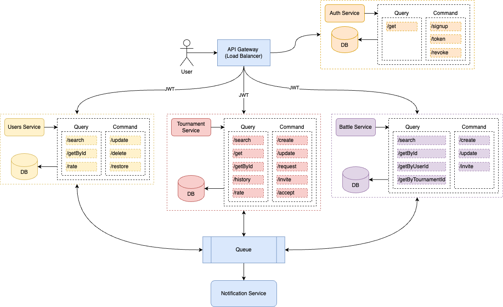

## Архитектура приложения для игры Танки

Архитектура представляет собой набор следующих микросервисов:
- **API Gateway** — централизованный узел в архитектуре приложения, обеспечивающий предоставление внешнего доступа к микросервисам и другим службам через единый API.
- **Auth Service** — сервис авторизации. Обеспечивает регистрацию и аутентификацию пользователей.
- **Users Service** — сервис управления пользователями. Хранит информацию о пользователях и их профилях. 
- **Battle Service** — сервис управления боями. Отслеживает битвы, их результаты и их доступность для просмотра. 
- **Tournament Service** — сервис управления турнирами боев. Разрешает пользователям создавать, управлять и участвовать в турнирах. 
- **Notification Service** — сервис уведомлений. Отправляет пользователям уведомления о приглашении на турнир, решение по заявке на участие в турнире, о завершении танкового боя, о скором начале стартового боя и тп.

Код в приложении придерживается принципу проектирования Command Query Separation (CQS), который гласит, что любой метод или функция должен либо изменять состояние системы (command), либо возвращать результат (query), но не оба одновременно. Это позволяет упростить проектирование и тестирование системы, а также повысить ее надежность и безопасность.

Взаимодействие между сервисами происходит через очередь событий (Queue). Что влечет за собой следующие плюсы:
- Слабая связность между сервисами.
- Ответственность за событие. Нет необходимости ждать ответа от других сервисов.
- Отказоустойчивость. При отказе одного из сервисов не блокируется работа остальных.

### Потенциальные проблемы масштабирования приложения

1. Большое количество пользователей:
    - Проблема: При резком увеличении числа пользователей возможны проблемы с производительностью и масштабируемостью системы.
    - Решение: Горизонтальное масштабирование с использованием кластеризации и балансировки нагрузки.

2. Интенсивные вычисления во время боев:
    - Проблема: При многих одновременных танковых боях может возникнуть нехватка вычислительных ресурсов.
    - Решение: Использование масштабируемых вычислительных ресурсов (например, облачных вычислений) и оптимизация алгоритмов.

3. Управление большим объемом данных:
    - Проблема: Накопление и обработка данных о турнирах, пользователях, рейтингах может вызвать проблемы с производительностью баз данных.
    - Решение: Использование распределенных баз данных, кэширование данных, оптимизация запросов.

4. Сетевые задержки и взаимодействие:
    - Проблема: При множестве серверных микросервисов возможно увеличение сетевой задержки и общей нагрузки на сеть.
    - Решение: Кэширование данных, использование протоколов сжатия данных, оптимизация сетевого взаимодействия.

### Компоненты, к которым чаще всего будут меняться требования
1. Управление турнирами:
   - Часто изменяемые требования: Форматы турниров, правила участия, категории турниров.
   - Применение OCP: Разделение на основной функционал управления турнирами и специфические алгоритмы обработки различных типов турниров с использованием паттернов стратегия или фабрика.

2. Управление рейтингом:
   - Часто изменяемые требования: Критерии начисления рейтинговых очков, алгоритмы расчета рейтинга.
   - Применение OCP: Выделение интерфейса для подсчета рейтинга и создание различных стратегий расчета рейтинга с возможностью динамического добавления новых стратегий без изменения основного кода с помощью паттерна стратегия.

3. Уведомления:
   - Часто изменяемые требования: Способы уведомления, виды событий для уведомлений.
   - Применение OCP: С использованием паттерна наблюдатель можно реализовать механизм, который позволит добавлять новые виды уведомлений и событий без изменения существующего кода.

